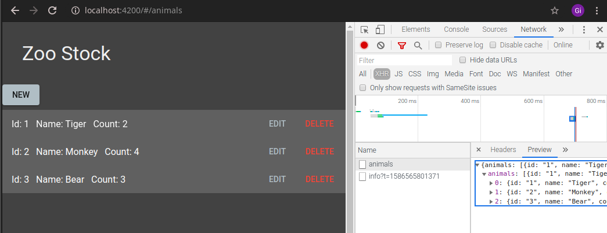

## Angular Fastify demo app

### How to run

- Clone this repo
- open a terminal, go to fastify (server) folder and run
  - `npm i`
  - `node server.js`
- go to zoostock (angular client) folder and run
  - `npm i`
  - `ng serve`

## SCREENCAST

### Documentation

https://angular.io

https://material.angular.io

https://www.fastify.io
